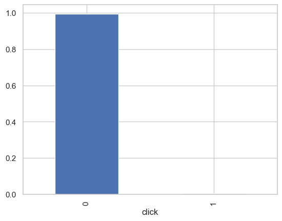
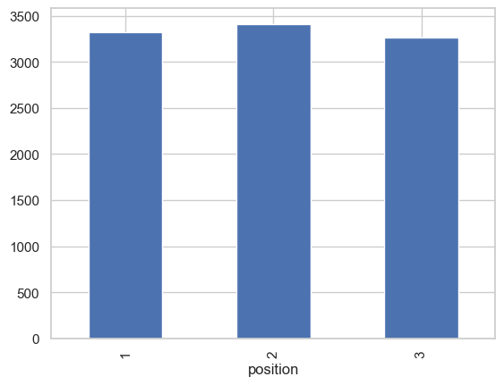
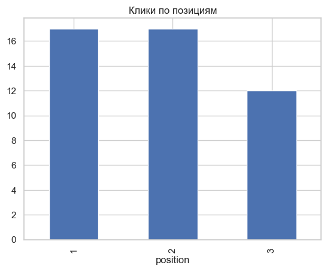
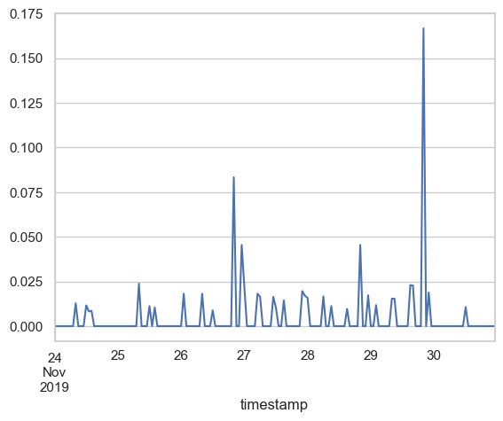
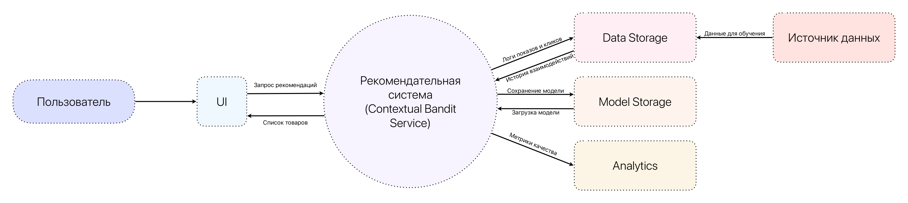
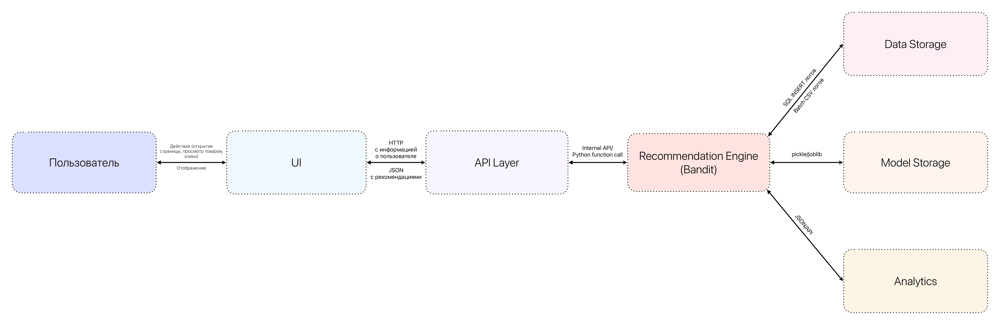

# Fashion-Recommendation-System

Кидяева Анастасия Павловна БВТ2201

## *Шаг 1. Выбор темы*

Рекомендательная система товаров fashion-сегмента с использованием bandit-алгоритмов (датасет ZOZO)

## *Шаг 2. Формулировка бизнес-задачи и её ML-интерпретация*
1. Какую проблему решает сервис?
   
Сервис решает проблему неэффективного подбора товаров в fashion-сегменте. При большом ассортименте пользователю сложно быстро найти релевантные товары, а бизнес теряет потенциальные продажи из-за низкой персонализации. Универсальные подборки и статические рекомендации не учитывают индивидуальные предпочтения и быстро меняющиеся интересы пользователей.

2. Какую выгоду он несёт и кто её получит?

Пользователь получает более релевантные рекомендации, экономит время на поиске и быстрее находит подходящие товары. Бизнес (онлайн-магазин) получает рост конверсии, среднего чека и удержания клиентов, а также более эффективное продвижение ассортимента. Дополнительно система помогает продвигать новые или менее популярные товары за счёт механизма исследования (exploration).

3. Зачем здесь ML? Какая его функция?

Машинное обучение необходимо для автоматической персонализации рекомендаций. В проекте используются bandit-алгоритмы (contextual multi-armed bandits), которые позволяют в реальном времени выбирать товары для показа пользователю, балансируя между:
exploitation — показом уже хорошо зарекомендовавших себя товаров;
exploration — тестированием новых или менее известных товаров.
ML-модель адаптируется к поведению пользователя и постепенно улучшает качество рекомендаций на основе получаемой обратной связи (клики, покупки).

4. Какие входные и выходные данные предполагаются?

Входные данные:

- История взаимодействий пользователя (клики, просмотры, покупки);

- Признаки пользователя (если доступны: пол, возраст, предпочтения);

- Признаки товара (категория, бренд, цвет, цена и др.);

- Контекст показа (время, устройство и т.д. — при наличии).

Выходные данные:

- Список из N рекомендованных товаров для конкретного пользователя;

- Оценка релевантности или вероятность отклика (click/purchase probability);

- Выбранное «действие» в рамках bandit-подхода (какой товар показать).

## *Шаг 3. Определение метрик качества*

1. Бизнес-метрики

Для оценки эффективности рекомендательной системы на уровне бизнеса используются следующие метрики:

**- CTR (Click-Through Rate)**

Доля пользователей, кликнувших на рекомендованный товар.
Рост CTR означает, что рекомендации становятся более релевантными.

**- CR (Conversion Rate)**

Доля пользователей, совершивших покупку после взаимодействия с рекомендацией.
Рост CR напрямую влияет на прибыль.

**- Средний чек (Average Order Value)**

Средняя сумма покупки одного заказа.
Показывает, сколько в среднем приносит один заказ. Если рекомендательная система работает хорошо: пользователь покупает больше товаров ➡ значит AOV растёт

**- Retention Rate**
Удержание пользователей во времени.
Персонализированные рекомендации повышают удовлетворённость и вероятность возвращения.

2. ML-метрики

Так как задача решается с помощью contextual multi-armed bandits, система обучается онлайн и получает частичную обратную связь.

Выбраны следующие ML-метрики:

**- Cumulative Reward**

Суммарная награда (например, количество кликов или покупок).
Это основная метрика для bandit-подхода, так как цель алгоритма — максимизация ожидаемой награды.

**- Average Reward**

Средняя награда на один показ.
Позволяет оценить качество рекомендаций в динамике.

**- Regret (Cumulative Regret)**

Разница между полученной наградой и максимально возможной наградой.
Показывает, насколько эффективно алгоритм балансирует exploration и exploitation.

**- Precision@K**

Доля релевантных товаров среди K рекомендованных.
Используется для офлайн-оценки качества рекомендаций.

## *Шаг 4. Источник данных и EDA*

В проекте используется Open Bandit Dataset (OBD) — открытый лог данных рекомендационной системы платформы ZOZOTOWN, опубликованный компанией ZOZO Research.
Датасет содержит реальные логи показов товаров и кликов пользователей и подходит для задач contextual multi-armed bandits и offline-оценки алгоритмов.

CSV-файлы содержат следующие признаки:

* timestamp — временная метка показа

* item_id — идентификатор товара (arm)

* 0–80 для кампании all

* 0–33 для men

* 0–46 для women

В датасете используется локальная индексация товаров. Для каждой кампании (all, men, women) формируется собственный набор товаров, поэтому item_id нумеруется отдельно внутри каждой кампании. В результате диапазон item_id различается: 0–80 для кампании all, 0–33 для men и 0–46 для women.

* position — позиция в интерфейсе рекомендации:

* 1 — слева

* 2 — центр

* 3 — справа

* click — целевая переменная (1 — клик, 0 — нет клика)

* propensity_score — вероятность показа товара (логированная вероятность поведения системы)

* user_feature_0 – user_feature_4 — пользовательские признаки

* user_item_affinity_* — показатель аффинити пользователя к товару (основан на количестве прошлых кликов)

Данные подходят для построения рекомендательной системы с использованием contextual bandit подхода, так как содержат информацию о действиях пользователя и обратной связи.

В датасете наблюдается явный дисбаланс классов: клики встречаются гораздо реже. Большинство показов не приводит к клику, и модель должна уметь выделять редкие успешные события.

Гистограмма позиций показывает, что классы почти сбалансированы, 2 позиция (центр) встречается в датасете немного чаще, чем остальные.

Чаще всего пользователи выбирали товары, расположенные на 1 и 2 позиции сайта.

Гистограмма вероятности показа товара отражает, в каких интервалаз находится уверенность системы в показе каждого товара в датасете.

На графике временной зависимости можно увидеть, как CTR меняется во времени.

## *Шаг 5. Проектирование высокоуровневой архитектуры системы*

### 1. Контекстная диаграмма

*Центральная система*

* Рекомендательная система fashion-товаров (Contextual Bandit Service)

*Внешние акторы*

* Пользователь — получает рекомендации и взаимодействует с товарами (клики, покупки).

* UI — отображает рекомендации в интерфейсе сайта или приложения.

*Внешние системы*

* Хранилище данных (Data Storage) — хранение логов показов и кликов.

* Система аналитики — расчет бизнес-метрик (CTR, CR).

* Источник данных (Open Bandit Dataset / логи) — данные для обучения.

* Model Storage — хранение обученной модели.

### 2. Основные потоки данных

* *Взаимодействие пользователя с системой*

1) Пользователь открывает страницу.

2) UI отправляет запрос в рекомендательную систему.

3) Система получает контекст пользователя, применяет bandit-алгоритм, выбирает товары.

4) UI отображает рекомендации.

5) Пользователь кликает (или нет).

6) Событие (click / no-click) логируется в Data Storage.

* *Поток данных для обучения*

1) Логи показов и кликов сохраняются в Data Storage.

2) Периодически формируется обучающая выборка.

3) Модель переобучается (offline training или incremental update).

4) Новая версия модели сохраняется в Model Storage.

5) Система обновляет активную модель.

* *Сохранение результатов*

1) Логи показов → Data Storage

2) Метрики качества → Analytics

3) Обновленная модель → Model Storage

## *Шаг 6. Выделение модулей и протоколов взаимодействия*

Основные модули системы

**1. API Gateway / Web API**

* Приём HTTP-запросов от UI;

* Передача контекста пользователя в Recommendation Engine;

* Возврат списка рекомендаций;

* Логирование событий.

**2. Recommendation Engine (Contextual Bandit Core)**

* Получение контекста пользователя;

* Выбор действия (item_id) на основе bandit-алгоритма;

* Баланс exploration / exploitation;

* Расчёт propensity_score;

* Возврат выбранных товаров.

**3. Logging Module**

* Сохранение user_features, выбранного item_id, позиции, click, propensity_score

* Формирование bandit-логов для последующего обучения.

**4. Data Storage**

* Хранение логов взаимодействий;

* Хранение обучающих выборок;

* Источник данных для обучения.

**5. Training Module**

* Подготовка данных;

* Offline-оценка (IPS, DR);

* Обучение / обновление bandit-модели;

* Сохранение модели в Model Storage.

**6. Model Storage**

* Хранение версий моделей;

* Управление версионированием;

* Передача актуальной модели в Recommendation Engine.

Протоколы взаимодействия

**1. UI ↔ API**

* Протокол: HTTP

* Формат: JSON

* Метод: POST /recommend

**2. API ↔ Recommendation Engine**

* Внутренний вызов (Python function call)

* Передача структурированных объектов

**3. Recommendation Engine → Logging Module**

* Асинхронная запись события

* Формат: JSON / structured log

**4. Training Module ↔ Data Storage**

* Batch-загрузка данных

* Формат: CSV / Parquet

**5. Training Module → Model Storage**

* Сохранение модели: torch model, numpy weights

## *Шаг 7. Предварительный выбор технологий и их обоснование*

*1. API Layer*

* Выбранная технология: Python + FastAPI

* Почему выбран FastAPI:

- Высокая производительность (асинхронность, основан на ASGI);

- Простота интеграции с ML-моделями на Python;

- Автоматическая генерация OpenAPI/Swagger;

- Удобная работа с Pydantic-моделями.

Почему не Django:

- Django избыточен для лёгкого ML-сервиса;

- Более тяжеловесная архитектура;

- Ниже производительность в сравнении с FastAPI для API-only сервиса.

*2. Recommendation Engine (Bandit Core)*

Выбранная технология: Python, NumPy, PyTorch

Почему Python:

- Стандарт для ML;

- Большое количество библиотек;

- Простота реализации bandit-алгоритмов.

Почему NumPy:

- Быстрая работа с векторами признаков;

- Подходит для LinUCB и простых моделей.

Почему PyTorch:

- Гибкость;

- Возможность расширения до нейросетевых contextual bandits;

- Удобство автодифференцирования.

Почему не TensorFlow:

- Более громоздкий;

- Избыточен для текущей задачи;

- PyTorch проще для research-подхода.

*3. Data Storage*

Выбранная технология: PostgreSQL (для логов), CSV / Parquet (для offline-анализа)

Почему PostgreSQL:

- Надёжность;

- Поддержка транзакций;

- Простота интеграции с Python.

Почему не NoSQL:

- Данные имеют структурированную табличную форму;

- Нет необходимости в document-oriented хранении.

*4. Logging Module*

Выбранная технология: Структурированные JSON-логи, Python logging

Почему:

- Простота реализации;

- Лёгкость последующей обработки;

- Совместимость с аналитическими инструментами.

*5. Training Module*

Выбранная технология: Python, Pandas, NumPy, Scikit-learn (для baseline), PyTorch (для расширенных моделей)

Почему:

- Pandas удобен для EDA;

- Scikit-learn подходит для baseline-моделей;

- Возможность легко тестировать разные bandit-алгоритмы.

Почему не Spark:

- Объём данных Open Bandit Dataset не требует распределённых вычислений;

- Усложняет архитектуру без необходимости.

*6. Model Storage*

Выбранная технология: pickle / joblib (для сохранения модели), Версионирование через файловую систему или S3-совместимое хранилище

Почему:

- Простота;

- Достаточно для прототипа и учебного проекта;

- Быстрая загрузка модели при старте сервиса.

Почему не MLflow:

- Избыточен для текущего масштаба;

- Добавляет инфраструктурную сложность.

7. Frontend

Выбранная технология: HTML + CSS + JavaScript

Почему:

- Простота реализации;

- Нет необходимости в сложной SPA-архитектуре;

- Минимальный overhead.

Почему не React:

- Проект носит исследовательский характер;

- UI вторичен по отношению к ML-части.
